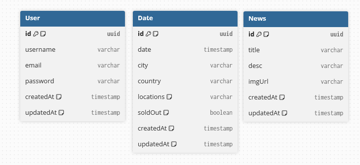

# Lab 201: Vald

## Github

Le projet étant développé en NextJS, frontend et backend sont au même endroit.

[Lien GitHub](https://github.com/martin-dinahet/lab-201)

## Choix technologiques

### Next JS

J’ai choisi Next.js comme framework principal pour son approche full-stack basée sur React. Il permet de développer des applications web performantes grâce à son support du rendu côté serveur (SSR), du rendu statique (SSG), et de l’incrémental static regeneration (ISR). Ces fonctionnalités améliorent significativement le référencement (SEO) et les temps de chargement. De plus, Next.js facilite l’organisation du projet grâce à son système de routage basé sur la structure des fichiers.

### TypeScript

L’utilisation de TypeScript apporte un typage statique au projet, ce qui permet de détecter les erreurs lors du développement plutôt qu’à l’exécution. Cela renforce la robustesse du code, facilite sa lisibilité et améliore la productivité grâce à une meilleure autocomplétion et documentation dans l’éditeur. Ce choix est particulièrement pertinent dans un projet en croissance ou collaboratif.

### TailwindCSS

J’ai opté pour TailwindCSS afin de concevoir une interface utilisateur réactive et cohérente rapidement. Ce framework CSS utilitaire permet de styliser les composants directement dans le JSX, ce qui accélère le développement tout en garantissant une grande personnalisation. Il permet également de conserver un design uniforme sans recourir à des feuilles de style complexes.

### Prisma

Prisma a été sélectionné comme ORM (Object-Relational Mapping) pour sa simplicité d’utilisation avec TypeScript, sa génération automatique de types et ses outils de migration de base de données. Il permet d’écrire des requêtes claires et sécurisées, tout en restant proche du modèle de données. Prisma améliore la maintenabilité de la couche d’accès aux données.

### PostgreSQL

Le projet utilise PostgreSQL comme système de gestion de base de données relationnelle pour sa fiabilité, ses performances, et sa richesse fonctionnelle (transactions, contraintes, index, types personnalisés, etc.). PostgreSQL est un choix pertinent pour une application nécessitant de la cohérence des données et une bonne évolutivité.

### Vercel

Le déploiement est effectué sur Vercel, la plateforme officielle de Next.js. Elle offre une intégration continue simple, un déploiement automatique via Git, ainsi qu’un CDN global performant. Cela garantit une mise en ligne rapide, sécurisée et optimisée de l’application, avec une gestion des environnements facilitée.

### Shadcn/ui

Enfin, Shadcn/ui a été choisi pour la construction de composants UI accessibles, typés, et directement compatibles avec TailwindCSS. Ce système de composants permet un design cohérent, moderne et personnalisable, tout en accélérant le développement de l’interface grâce à une base de composants réutilisables.

### Zod

J’ai choisi Zod pour gérer la validation des données côté serveur. Cette bibliothèque est particulièrement adaptée à un projet TypeScript, car elle permet de définir des schémas de validation tout en générant automatiquement les types associés. Cela garantit une cohérence forte entre les données attendues et leur traitement, tout en réduisant les risques d’erreurs. Zod simplifie la validation des requêtes entrantes (formulaires, API) et permet une gestion claire des erreurs côté backend.

## Stratégies de sécurité

L'application met en œuvre plusieurs stratégies de sécurité afin de protéger les données utilisateurs, garantir l’intégrité des sessions, et limiter les risques d’exploitation liés aux failles courantes du web (XSS, CSRF, etc.).

### Authentification basée sur JWT et cookies HTTP-only

L’authentification repose sur un système combinant JSON Web Tokens (JWT) et cookies sécurisés :

- Lors de la connexion, un JWT signé est généré côté serveur, contenant les informations d’identification minimales (ID utilisateur, date d’expiration, etc.).
- Ce token est stocké dans un cookie HTTP-only, ce qui le rend inaccessible depuis le JavaScript client et donc résistant aux attaques XSS.
- Le cookie est configuré avec les attributs Secure (pour HTTPS), HttpOnly, et SameSite=Lax ou Strict pour limiter les risques de CSRF.

Cette stratégie permet une authentification stateless tout en conservant la sécurité des sessions grâce au stockage côté navigateur dans un espace protégé.

### Middleware d’authentification

Un middleware personnalisé est chargé de valider l’authentification sur les routes protégées :

- Il récupère le cookie contenant le JWT
- Il vérifie la signature du token, son expiration, et la présence d’un utilisateur valide
- En cas d’échec, la requête est rejetée ou redirigée (selon l’usage : API ou page)

Ce middleware centralise le contrôle d’accès, ce qui garantit une cohérence et une sécurité renforcée sur l’ensemble des routes sensibles.

### Stockage sécurisé des mots de passe

Tous les mots de passe utilisateurs sont hachés avec l’algorithme bcrypt avant d’être stockés en base de données. Cela garantit que même en cas de fuite de données, les mots de passe ne seront pas exploitables en clair.

### Protection contre les injections et failles classiques

- Toutes les données utilisateurs sont validées et échappées côté serveur pour prévenir les injections (SQL, XSS)

- Prisma en tant qu’ORM ajoute une couche de sécurité supplémentaire en protégeant des injections SQL

- Les erreurs exposées au client sont génériques, évitant toute fuite d’information sur la structure interne de l’application

- L'application utilise Zod pour la validation des données côté serveur. Zod est une bibliothèque TypeScript-first qui permet de définir des schémas de validation clairs, typés et réutilisables.

### Utilisation de HTTPS

L’application est déployée sur Vercel, qui propose un certificat HTTPS automatique. Toutes les communications client-serveur sont donc chiffrées, ce qui protège les données sensibles en transit (authentification, formulaire, etc.).

## Déploiement

Le site est déjà en ligne et déployé sur Vercel [ici](https://lab-201.vercel.app)

## Évaluation du temps de travail – Projet Vald (Front + Back + Dashboard Admin)

**Période estimée** : 3 semaines (15 jours ouvrés)  
**Volume horaire total** : ~105 heures (environ 7h/jour)

---

### Répartition des tâches

| Phase                       | Tâches principales                                                              | Temps estimé     |
| --------------------------- | ------------------------------------------------------------------------------- | ---------------- |
| Initialisation projet       | Setup de Next.js, TailwindCSS, Prisma, PostgreSQL, Zod, auth, structure de base | 1.5 jours (~10h) |
| Design & UI                 | Maquettage léger, intégration des composants avec Tailwind et shadcn/ui         | 2.5 jours (~17h) |
| Frontend utilisateur        | Pages publiques (accueil, contenu), responsive, interactions de base            | 3 jours (~21h)   |
| Authentification / Session  | Login/register avec JWT + cookie HTTP-only, middleware, validation Zod          | 1.5 jours (~10h) |
| Backend (API / BDD)         | Modélisation Prisma, endpoints REST ou RPC, validation serveur, logique métier  | 2 jours (~14h)   |
| Dashboard administrateur    | Interface privée, CRUD de contenu, composants réutilisables                     | 3 jours (~21h)   |
| Tests & vérifications       | Vérifications manuelles, tests fonctionnels sur les flux principaux             | 1 jour (~7h)     |
| Déploiement / Mise en ligne | Configuration sur Vercel, environnement, dernières vérifications                | 0.5 jour (~3h)   |
| Documentation technique     | Rédaction du README, doc architecture, schémas, sécurité, consignes d’usage     | 0.5 jour (~2h)   |

---

**Total estimé** : 105 heures / 15 jours ouvrés

## Fonctionnalités Admin

### 1. Connexion / Authentification

- formulaire de connexion sécurisé (email / mot de passe)
- gestion des sessions avec JWT et cookies HTTP-only
- middleware d’authentification pour protéger les routes admin
- déconnexion (logout) sécurisée
- gestion des erreurs

### 2. Gestion des Dates (CRUD Dates)

- liste des dates / événements enregistrés
- création d’une nouvelle date / événement avec formulaire (titre, description, date, lieu, etc.)
- modification d’une date / événement existante via formulaire pré-rempli
- suppression d’une date / événement avec confirmation
- validation des données en entrée (ex : date valide, champs obligatoires)
- recherche / filtrage des dates / événements

### 3. Gestion des News (CRUD News)

- liste paginée des actualités publiées
- création d’une news (titre, contenu texte, image(s), date de publication)
- modification d’une news existante avec formulaire pré-rempli
- suppression d’une news avec confirmation
- validation des champs (taille image, format, texte obligatoire, etc.)
- recherche / filtrage des news

## Recettage Admin

### 1. Connexion / Authentification

- [x] Le formulaire de connexion accepte un email et un mot de passe valides
- [x] La session est créée via JWT et stockée dans un cookie HTTP-only après connexion réussie
- [x] L’accès aux routes admin est bloqué si l’utilisateur n’est pas authentifié (middleware)
- [x] L’utilisateur peut se déconnecter (logout) et la session est détruite
- [x] Les erreurs de connexion sont affichées clairement (identifiants invalides, etc.)

### 2. Gestion des Dates (CRUD Dates)

- [x] La liste des dates / événements s’affiche correctement
- [x] Il est possible de créer une nouvelle date / événement via un formulaire
- [x] Le formulaire de création vérifie la validité des données (champs obligatoires, date valide)
- [x] Une date / événement existante peut être modifiée via un formulaire pré-rempli
- [ ] La suppression d’une date / événement demande une confirmation avant exécution
- [x] La recherche et le filtrage dans la liste des dates / événements fonctionnent correctement

### 3. Gestion des News (CRUD News)

- [x] La liste paginée des actualités s’affiche correctement
- [x] Il est possible de créer une news avec titre, contenu, images et date de publication
- [x] Le formulaire de création / modification valide correctement les champs (taille image, format, texte obligatoire)
- [x] Une news existante peut être modifiée via un formulaire pré-rempli
- [x] La suppression d’une news demande confirmation avant exécution
- [x] La recherche et le filtrage dans la liste des news fonctionnent correctement

## Diagramme UML de la base de données

